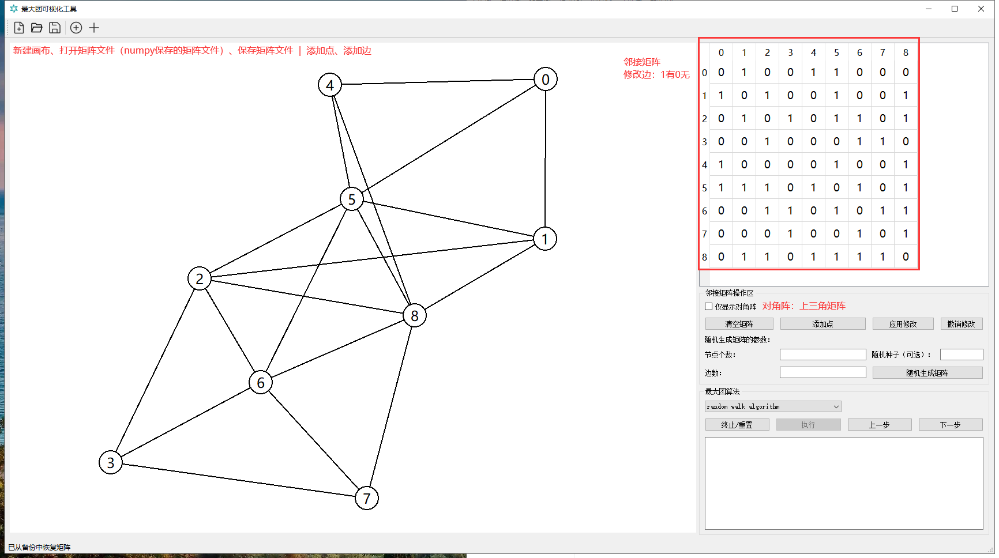

# Maximum_Clique_Visualization
##  最大团可视化工具

本项目界面使用PYQT5绘制，实现了自由绘图、绘边，图与邻接矩阵的互相转换，随机生成邻接矩阵进而画出图，实现了矩阵文件的打开与保存。图中各点的坐标使用[networkx](https://github.com/networkx/networkx)获取。

### 界面

### 画图区

- 按下添加点按钮，在左侧画图区域上通过单击自由添加点
- 按下添加边按钮，任意连击两个点之间（再添加边的过程中边不会时时显示）
- 各点可自由拖动

----

### 邻接矩阵

- 修改邻接矩阵 -> 应用（图可能会应新加入的边重新进行布局）
- 给定参数随机生成邻接矩阵，随机种子用于重现

----

### 最大团算法

- 基于随机游走的最大团算法，本项目（课程没有完全实现），另一个是有bug的回溯法
- 基于回溯法可动态展示每次找到的极大团，单步操作可用
